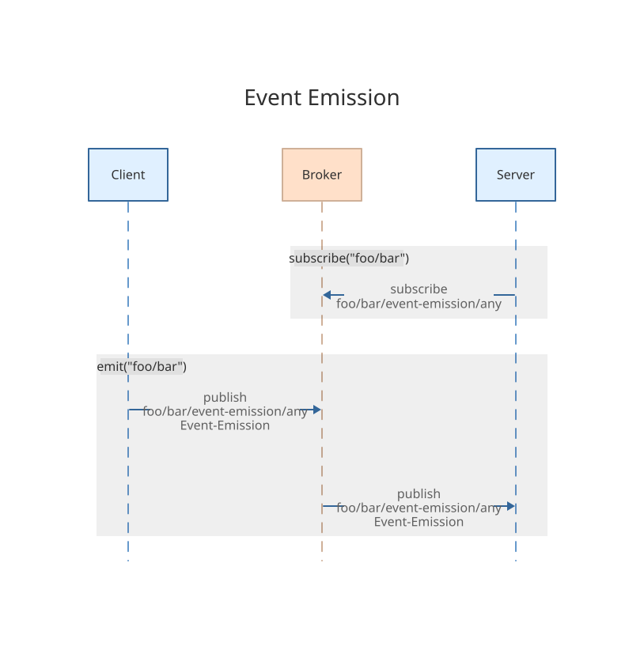
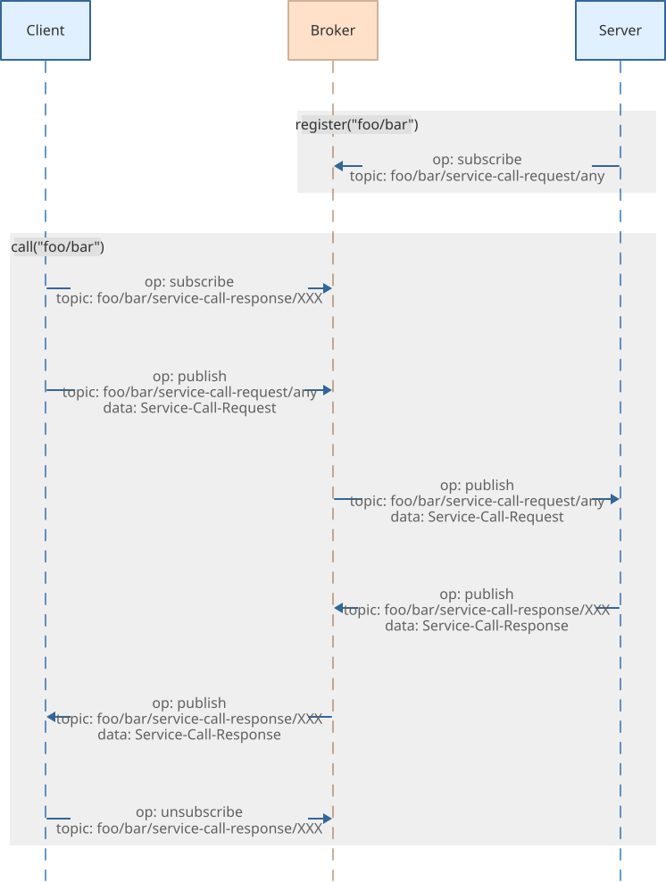
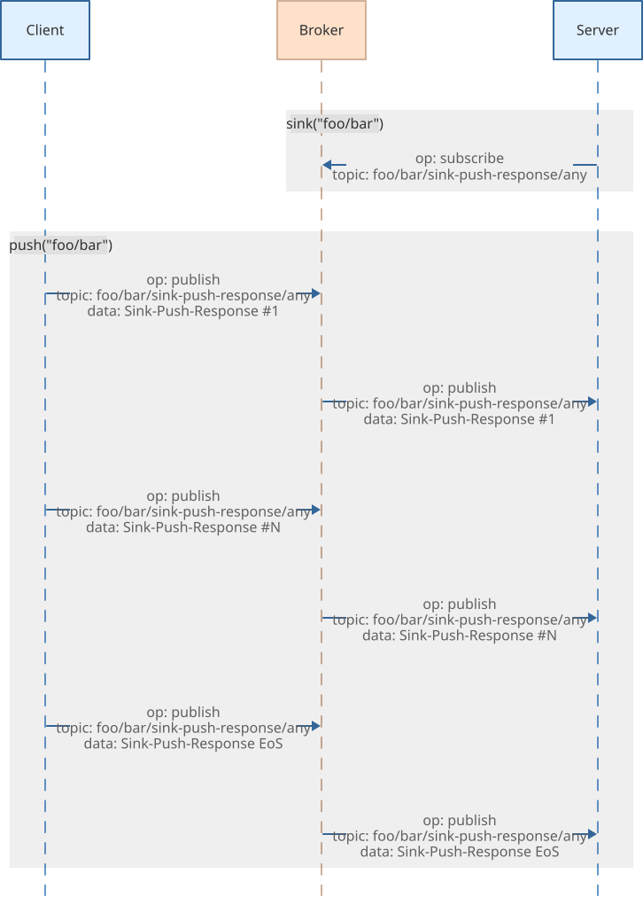

MQTT+
=====

[MQTT](http://mqtt.org/) Communication Patterns

<p/>


[](https://github.com/rse)
[](https://github.com/rse)

Installation
------------

```shell
$ npm install mqtt mqtt-plus
```

About
-----

This is **MQTT+**, a companion addon API for the excellent
[MQTT](http://mqtt.org/) client TypeScript/JavaScript API
[MQTT.js](https://www.npmjs.com/package/mqtt), providing additional
communication patterns with type safety:

- **Event Emission**:

  Event Emission is a *uni-directional* communication pattern.
  An Event is the combination of an event name and optionally zero or more parameters.
  You *register* for events.
  When an event is *emitted*, either a single particular receiver (in
  case of a directed event emission) or *all* receivers are called and
  receive the parameters as extra information.

  In contrast to the regular MQTT message publish/subscribe, this
  pattern allows to direct the event to particular receivers and
  provides optional information about the sender and receiver to
  receivers.

  

- **Service Call**:

  Service Call is a *bi-directional* communication pattern.
  A Service is the combination of a service name and optionally zero or more parameters.
  You *register* a service.
  When a service is *called*, a single particular receiver (in case
  of a directed service call) or *one* arbitrary receiver is called and
  receives the arguments as the request. The receiver then has to
  provide the service response.

  In contrast to the regular uni-directional MQTT message
  publish/subscribe communication, this allows a bi-directional [Remote
  Procedure Call](https://en.wikipedia.org/wiki/Remote_procedure_call)
  (RPC) style communication.

  

- **Sink Push**:

  Sink Push is a *uni-directional* communication pattern for pushing data.
  A Sink is the combination of a sink name and optionally zero or more parameters.
  You *register* a *sink* for receiving pushed data chunks.
  When data is *pushed*, a single particular sink (in case of a directed
  sink push) or *one* arbitrary sink is called and receives the data
  chunks as a stream with arguments.

  In contrast to the regular MQTT message publish/subscribe, this
  pattern allows to transfer arbitrary amounts of arbitrary data by
  chunking the data via a stream. Additionally, it supports optional
  meta-data transfer alongside the data.

  

- **Source Fetch**:

  Source Fetch is a *bi-directional* communication pattern for fetching data.
  A Source is the combination of a source name and optionally zero or more parameters.
  You *register* a *source* for sending data chunks.
  When data is *fetched*, a single particular source (in case of a
  directed source fetch) or *one* arbitrary source is called and sends the
  data chunks as a stream with arguments.

  In contrast to the regular MQTT message publish/subscribe, this
  pattern allows to transfer arbitrary amounts of arbitrary data by
  chunking the data via a stream. Additionally, it supports optional
  meta-data transfer alongside the data.

  

Usage
-----

### API:

The API type defines the available endpoints. Use the marker types
`Event<T>`, `Service<T>`, `Source<T>`, and `Sink<T>` to declare the
communication pattern of each endpoint:

```ts
import type { Event, Service, Source, Sink } from "mqtt-plus"

export type API = {
    "example/sample":   Event<(a1: string, a2: number) => void>
    "example/hello":    Service<(a1: string, a2: number) => string>
    "example/download": Source<(filename: string) => void>
    "example/upload":   Sink<(filename: string) => void>
}
```

The marker types ensure that `event()` and `emit()` only accept
`Event<T>` endpoints, `service()` and `call()` only accept
`Service<T>` endpoints, `source()` and `fetch()` only
accept `Source<T>` endpoints, and `sink()` and `push()` only
accept `Sink<T>` endpoints.

### Server:

```ts
import MQTT         from "mqtt"
import MQTTp        from "mqtt-plus"
import type { API } from [...]

const mqtt  = MQTT.connect("wss://127.0.0.1:8883", { [...] })
const mqttp = new MQTTp<API>(mqtt)

mqtt.on("connect", async () => {
    await mqttp.event("example/sample", (a1, a2, info) => {
        console.log("example/sample: SERVER:", a1, a2, info.sender)
    })
    await mqttp.service("example/hello", (a1, a2, info) => {
        console.log("example/hello: SERVER:", a1, a2, info.sender)
        return `${a1}:${a2}`
    })
    await mqttp.source("example/download", async (filename, info) => {
        console.log("example/download: SERVER:", filename, info.sender)
        info.buffer = Promise.resolve(mqttp.str2buf(`the ${filename} content`))
    })
    await mqttp.sink("example/upload", async (filename, info) => {
        console.log("example/upload: SERVER:", filename, info.sender)
        const data = await info.buffer
        console.log("received", data.length, "bytes")
    })
})
```

### Client:

```ts
import MQTT         from "mqtt"
import MQTTp        from "mqtt-plus"
import type { API } from [...]

const mqtt = MQTT.connect("wss://127.0.0.1:8883", { [...] })
const mqttp = new MQTTp<API>(mqtt)

mqtt.on("connect", async () => {
    mqttp.emit("example/sample", "world", 42)

    const callOutput = await mqttp.call("example/hello", "world", 42)
    console.log("example/hello: CLIENT:", callOutput)

    const fetchOutput = await mqttp.fetch("example/download", "foo")
    const data = mqttp.buf2str(await fetchOutput.buffer)
    console.log("example/download: CLIENT:", data)

    const pushInput = mqttp.str2buf("uploaded content")
    await mqttp.push("example/upload", pushInput, "myfile.txt")

    mqtt.end()
})
```

Application Programming Interface
---------------------------------

The **MQTT+** API provides the following methods:

- **Construction**:<br/>

      /*  (simplified TypeScript API method signature)  */
      constructor<API extends Record<string,
          Event<   (...args: any[]) => void | Promise<void>> |
          Service< (...args: any[]) => any  | Promise<any> > |
          Source<  (...args: any[]) => void | Promise<void>> |
          Sink<    (...args: any[]) => void | Promise<void>>
      >>(
          mqtt: MqttClient | null,
          options?: {
              id:         string
              codec:      "cbor" | "json"
              timeout:    number
              chunkSize:  number
              topicMake:  (name: string, operation: string, peerId?: string) => string
              topicMatch: (topic: string) => { name: string, operation: string, peerId?: string } | null
          }
      )

  The `API` is a TypeScript type,
  describing the available events, services, sources, and sinks.

  The `mqtt` is the [MQTT.js](https://www.npmjs.com/package/mqtt) instance,
  which has to be established separately. A `null` MQTT instance can be
  used for performing dry-runs (see *Dry-Run Publishing for MQTT Last-Will* under
  **Event Emission** below).

  The optional `options` object supports the following fields:
  - `id`: Custom MQTT peer identifier (default: auto-generated NanoID).
  - `codec`: Encoding format, either `cbor` or `json` (default: `cbor`).
  - `timeout`: Communication timeout in milliseconds (default: `10000`).
  - `chunkSize`: Chunk size in bytes for source/sink transfers (default: `16384`).
  - `topicMake`: Custom topic generation function.
    The `operation` parameter is one of: `event-emission`, `service-call-request`, `service-call-response`, `source-fetch-request`, `source-fetch-response`, `source-fetch-chunk`, `sink-push-response`.
    (default: `` (name, operation, peerId) => `${name}/${protocol}/${peerId ?? "any"}` ``)
  - `topicMatch`: Custom topic matching function.
    Returns `{ name, operation, peerId? }` or `null` if no match.
    The `peerId` is `undefined` for broadcast topics (ending with `/any`).
    (default: `` (topic) => { const m = topic.match(/^(.+)\/([^/]+)\/([^/]+)$/); return m ? { name: m[1], operation: m[2], peerId: m[3] === "any" ? undefined : m[3] } : null } ``)

- **Destruction**:<br/>

      destroy(): void

  Clean up the MQTT+ instance by removing all event listeners.
  Call this method when the instance is no longer needed.
  The companion MQTT.js instance has to be destroyed separately.

- **Authentication**:<br/>

  MQTT+ provides JWT-based authentication for securing events, services,
  sources, and sinks. Authentication works by issuing tokens on the
  server-side and validating them when messages are received.

      /*  store server-side secret credential  */
      credential(credential: string): void

      /*  issue client-side token on server-side  */
      issue(payload: { roles: string[], id?: string }): Promise<string>

      /*  add/remove client-side token (client-side)  */
      authenticate(token: string): void
      authenticate(token: string, remove: true): void

  The `credential()` method sets the secret key used for signing and
  verifying JWT tokens. This must be called before `issue()` can be
  used.

  The `issue()` method creates a new JWT token with the specified `roles` array.
  The optional `id` field can bind the token to a specific client identifier.

  The `authenticate()` method manages client-side tokens:
  called with a token, adds the token to the set of active tokens;
  called with a token and `true`, removes the token from the set.

  When a client has tokens set via `authenticate()`, they are automatically
  included in outgoing `emit()`, `call()`, `push()`, and `fetch()` requests.

  Example:

      /*  server: set credential and issue token  */
      mqttp.credential("my-secret-key")
      const token = await mqttp.issue({ roles: [ "admin", "user" ] })

      /*  client: add token for authentication  */
      mqttp.authenticate(token)

- **Meta Information**:<br/>

  MQTT+ allows attaching persistent meta-data to an instance that is
  automatically included in all outgoing messages. This is useful for
  adding context information like client version, environment, or user
  identity to every request.

      /*  set meta information by key  */
      meta(key: string, value: any): void

      /*  delete meta information by key  */
      meta(key: string): void

  The `meta()` method manages instance-level meta-data:
  called with a key only, deletes the meta-data entry for that key;
  called with a key and value, sets the meta-data entry.

  Instance-level meta-data set via `meta()` is merged with any per-request
  `meta` option passed to `emit()`, `call()`, `push()`, or `fetch()`.
  Per-request meta-data takes precedence over instance-level metadata.

  On the receiving side, meta-data is available via the `info.meta`
  field in callbacks for `event()`, `service()`, `source()`, and `sink()`.
  For `fetch()`, the returned `meta` promise resolves to the meta-data
  sent by the source.

  Example usage:

      /*  client: set instance-level metadata  */
      mqttp.meta("clientVersion", "1.0.0")
      mqttp.meta("environment", "production")

      /*  client: delete a metadata entry  */
      mqttp.meta("environment")

      /*  client: per-request metadata (merged with instance-level)  */
      mqttp.call({ name: "example/hello", params: [ "world" ], meta: { requestId: "123" } })

      /*  server: access meta-data in callback  */
      await mqttp.service("example/hello", (arg, info) => {
          console.log(info.meta?.clientVersion)  /*  "1.0.0"  */
          console.log(info.meta?.requestId)      /*  "123"    */
          return `hello ${arg}`
      })

- **Event Registration**:<br/>

      /*  (simplified TypeScript API method signature)  */
      event(
          name:     string,
          callback: (
              ...params: any[],
              info: {
                  sender:         string,
                  receiver?:      string,
                  authenticated?: boolean,
                  meta?:          Record<string, any>
              }
          ) => void | Promise<void>
      ): Promise<Registration>
      event({
          name:     string,
          callback: (
              ...params: any[],
              info: {
                  sender:         string,
                  receiver?:      string,
                  authenticated?: boolean,
                  meta?:          Record<string, any>
              }
          ) => void | Promise<void>,
          options?: MQTT::IClientSubscribeOptions,
          share?:   string,
          auth?:    string | { mode: "require" | "optional", roles: string[] }
      }): Promise<Registration>

  Register for an event.
  The `name` has to be a valid MQTT topic name.
  The `callback` is called with the `params` passed to a remote `emit()`.
  There is no return value of `callback`.
  The optional `options` allows setting MQTT.js `subscribe()` options like `qos`.
  The optional `share` enables [MQTT Shared Subscriptions](https://docs.oasis-open.org/mqtt/mqtt/v5.0/os/mqtt-v5.0-os.html#_Toc3901250)
  (MQTT 5.0) for load-balancing messages across multiple registrations by specifying
  a group name. This internally prefixes the event with `$share/<share>/`.
  The optional `auth` enables authentication validation on incoming events.
  When set to a role name string (e.g., `"admin"`), authentication is required
  and the token must include that role. When set to an object `{ mode, roles }`,
  the mode can be `"require"` (reject unauthenticated) or `"optional"` (accept all
  but reflect validation result in `info.authenticated`), and roles specifies
  the required role names.

  Internally, on the MQTT broker, the topics generated by
  `topicMake(name, "event-emission")` (default: `${name}/event-emission/any` and
  `${name}/event-emission/${peerId}`) are subscribed. Returns an
  `EventRegistration` object with a `destroy()` method.

- **Service Establishment**:<br/>

      /*  (simplified TypeScript API method signature)  */
      service(
          name:     string,
          callback: (
              ...params: any[],
              info: {
                  sender:         string,
                  receiver?:      string,
                  authenticated?: boolean,
                  meta?:          Record<string, any>
              }
          ) => any | Promise<any>
      ): Promise<Registration>
      service({
          name:     string,
          callback: (
              ...params: any[],
              info: {
                  sender:         string,
                  receiver?:      string,
                  authenticated?: boolean,
                  meta?:          Record<string, any>
              }
          ) => any | Promise<any>,
          options?: MQTT::IClientSubscribeOptions,
          share?:   string,
          auth?:    string | { mode: "require" | "optional", roles: string[] }
      }): Promise<Registration>

  Register a service.
  The `name` has to be a valid MQTT topic name.
  The `callback` is called with the `params` passed to a remote `call()`.
  The return value of `callback` will resolve the `Promise` returned by the remote `call()`.
  The optional `options` allows setting MQTT.js `subscribe()` options like `qos`.
  The optional `share` enables [MQTT Shared Subscriptions](https://docs.oasis-open.org/mqtt/mqtt/v5.0/os/mqtt-v5.0-os.html#_Toc3901250)
  (MQTT 5.0) for load-balancing service calls across multiple services by specifying
  a group name. This internally prefixes the service with `$share/<share>/`.
  By default a share named `default` is used.
  The optional `auth` enables authentication validation on incoming service calls.
  When set to a role name string (e.g., `"admin"`), authentication is required
  and the token must include that role. When set to an object `{ mode, roles }`,
  the mode can be `"require"` (reject unauthenticated with error response) or
  `"optional"` (accept all but reflect validation result in `info.authenticated`),
  and roles specifies the required role names.

  Internally, on the MQTT broker, the topics generated by
  `topicMake(name, "service-call-request")` (default: `${name}/service-call-request/any` and
  `${name}/service-call-request/${peerId}`) are subscribed. Returns a
  `Registration` object with a `destroy()` method.

- **Source Establishment (for Fetch)**:<br/>

      /*  (simplified TypeScript API method signature)  */
      source(
          name:     string,
          callback: (
              ...params: any[],
              info: {
                  sender:         string,
                  receiver?:      string,
                  authenticated?: boolean,
                  meta?:          Record<string, any>,
                  stream?:        Readable,
                  buffer?:        Promise<Uint8Array>
              }
          ) => void | Promise<void>
      ): Promise<Registration>
      source({
          name:     string,
          callback: (
              ...params: any[],
              info: {
                  sender:         string,
                  receiver?:      string,
                  authenticated?: boolean,
                  meta?:          Record<string, any>,
                  stream?:        Readable,
                  buffer?:        Promise<Uint8Array>
              }
          ) => void | Promise<void>,
          options?: MQTT::IClientSubscribeOptions,
          share?:   string,
          auth?:    string | { mode: "require" | "optional", roles: string[] }
      }): Promise<Registration>

  Register a source for sending data.
  The `name` has to be a valid MQTT topic name.
  The optional `options` allows setting MQTT.js `subscribe()` options like `qos`.
  The optional `share` enables [MQTT Shared Subscriptions](https://docs.oasis-open.org/mqtt/mqtt/v5.0/os/mqtt-v5.0-os.html#_Toc3901250)
  (MQTT 5.0) for load-balancing source requests across multiple sources by specifying
  a group name. This internally prefixes the source with `$share/<share>/`.
  By default a share named `default` is used.
  The optional `auth` enables authentication validation on incoming source requests.
  When set to a role name string (e.g., `"admin"`), authentication is required
  and the token must include that role. When set to an object `{ mode, roles }`,
  the mode can be `"require"` (reject unauthenticated) or `"optional"` (accept all
  but reflect validation result in `info.authenticated`), and roles specifies
  the required role names.

  The `callback` is called with the `params` passed to a remote `fetch()`.
  The `callback` should set `info.stream` to a `Readable` or `info.buffer` to a `Promise<Uint8Array>` containing the data.
  Optionally, the `callback` can set `info.meta` to a `Record<string, any>` to send metadata back with the response.

  Internally, on the MQTT broker, the topics by
  `topicMake(name, "source-fetch-request")`
  (default: `${name}/source-fetch-request/any` and `${name}/source-fetch-request/${peerId}`)
  are subscribed. Returns a `Sourcing` object with a `destroy()` method.

- **Sink Establishment (for Push)**:<br/>

      /*  (simplified TypeScript API method signature)  */
      sink(
          name:     string,
          callback: (
              ...params: any[],
              info: {
                  sender:         string,
                  receiver?:      string,
                  authenticated?: boolean,
                  meta?:          Record<string, any>,
                  stream?:        Readable,
                  buffer?:        Promise<Uint8Array>
              }
          ) => void | Promise<void>
      ): Promise<Registration>
      sink({
          name:     string,
          callback: (
              ...params: any[],
              info: {
                  sender:         string,
                  receiver?:      string,
                  authenticated?: boolean,
                  meta?:          Record<string, any>,
                  stream?:        Readable,
                  buffer?:        Promise<Uint8Array>
              }
          ) => void | Promise<void>,
          options?: MQTT::IClientSubscribeOptions,
          share?:   string,
          auth?:    string | { mode: "require" | "optional", roles: string[] }
      }): Promise<Registration>

  Register a sink for receiving data.
  The `name` has to be a valid MQTT topic name.
  The optional `options` allows setting MQTT.js `subscribe()` options like `qos`.
  The optional `share` enables [MQTT Shared Subscriptions](https://docs.oasis-open.org/mqtt/mqtt/v5.0/os/mqtt-v5.0-os.html#_Toc3901250)
  (MQTT 5.0) for load-balancing sink pushes across multiple sink handlers by specifying
  a group name. This internally prefixes the sink with `$share/<share>/`.
  By default a share named `default` is used.
  The optional `auth` enables authentication validation on incoming sink pushes.
  When set to a role name string (e.g., `"admin"`), authentication is required
  and the token must include that role. When set to an object `{ mode, roles }`,
  the mode can be `"require"` (reject unauthenticated) or `"optional"` (accept all
  but reflect validation result in `info.authenticated`), and roles specifies
  the required role names.

  The `callback` is called with the `params` passed to a remote `push()`.
  The `info.stream` provides a Node.js `Readable` stream for consuming the pushed data.
  The `info.buffer` provides a lazy `Promise<Uint8Array>` that resolves to the complete data once the stream ends.
  The `info.meta` contains optional metadata sent by the pusher via `push()`.

  Internally, on the MQTT broker, the topics by
  `topicMake(name, "sink-push-response")`
  (default: `${name}/sink-push-response/any` and `${name}/sink-push-response/${peerId}`)
  are subscribed. Returns a `Sinking` object with a `destroy()` method.

- **Event Emission**:<br/>

      /*  (simplified TypeScript API method signature)  */
      emit(
          event:     string,
          ...params: any[]
      ): void
      emit({
          event:     string,
          params:    any[],
          receiver?: string,
          options?:  MQTT::IClientSubscribeOptions,
          meta?:     Record<string, any>
      }): void
      emit({
          event:     string,
          params:    any[],
          receiver?: string,
          options?:  MQTT::IClientSubscribeOptions,
          meta?:     Record<string, any>,
          dry:       true
      }): { topic: string, payload: string | Uint8Array, options: IClientPublishOptions }

  Emit an event to all subscribers or a specific subscriber ("fire and forget").
  The optional `receiver` directs the event to a specific subscriber only.
  The optional `options` allows setting MQTT.js `publish()` options like `qos` or `retain`.
  The optional `meta` sends additional metadata alongside the event,
  which is merged with instance-level metadata set via `meta()`.
  The optional `dry` flag, when set to `true`, returns the publish information
  (`topic`, `payload`, `options`) instead of actually publishing to the MQTT broker.
  This is useful for generating MQTT "last will" messages (see example below).

  The remote `subscribe()` `callback` is called with `params` and its
  return value is silently ignored.

  Internally, publishes to the MQTT topic by `topicMake(event, "event-emission", peerId)`
  (default: `${event}/event-emission/any` or `${event}/event-emission/${peerId}`).

  *Dry-Run Publishing for MQTT Last-Will:*
  When you need to set up an MQTT "last will" message (automatically published
  by the broker when a client disconnects *unexpectedly*), you can use `dry: true`
  together with a `null` MQTT client:

      type API = {
          "example/connection": Event<(state: "open" | "close") => void>
          [...]
      }
      const mqttpDry = new MQTTp<API>(null, { id: "my-client" })
      const will = mqttpDry.emit({
          dry:    true,
          event:  "example/connection",
          params: [ "close" ],
          [...]
      })
      mqttpDry.destroy()
      const mqtt = MQTT.connect("[...]", {
          will: {
              topic:   will.topic,
              payload: will.payload,
              qos:     will.options.qos
          },
          [...]
      })

- **Service Call**:<br/>

      /*  (simplified TypeScript API method signature)  */
      call(
          name:      string,
          ...params: any[]
      ): Promise<any>
      call({
          name:      string,
          params:    any[],
          receiver?: string,
          options?:  MQTT::IClientPublishOptions,
          meta?:     Record<string, any>
      }): Promise<any>

  Call a service on all registrants or on a specific registrant ("request and response").
  The optional `receiver` directs the call to a specific registrant only.
  The optional `options` allows setting MQTT.js `publish()` options like `qos` or `retain`.
  The optional `meta` sends additional metadata alongside the service call,
  which is merged with instance-level metadata set via `meta()`.

  The remote `service()` `callback` is called with `params` and its
  return value resolves the returned `Promise`. If the remote `callback`
  throws an exception, this rejects the returned `Promise`.

  Internally, on the MQTT broker, the topic by `topicMake(service, "service-call-response", peerId)`
  (default: `${service}/service-call-response/${peerId}`) is temporarily subscribed
  for receiving the response.

- **Source Fetch**:<br/>

      /*  (simplified TypeScript API method signature)  */
      fetch(
          name:      string,
          ...params: any[]
      ): Promise<{
          stream:    Readable,
          buffer:    Promise<Uint8Array>,
          meta:      Promise<Record<string, any> | undefined>
      }>
      fetch({
          name:      string,
          params:    any[],
          receiver?: string,
          options?:  MQTT::IClientSubscribeOptions,
          meta?:     Record<string, any>
      }): Promise<{
          stream:    Readable,
          buffer:    Promise<Uint8Array>,
          meta:      Promise<Record<string, any> | undefined>
      }>

  Fetches data from any source or from a specific source.
  The optional `receiver` directs the call to a specific source only.
  The optional `options` allows setting MQTT.js `publish()` options like `qos` or `retain`.
  The optional `meta` sends additional metadata alongside the fetch request,
  which is merged with instance-level metadata set via `meta()`.

  Returns an object with a `stream` (`Readable`) for consuming the transferred data,
  a lazy `buffer` (`Promise<Uint8Array>`) that resolves to the complete data once the stream ends,
  and a `meta` (`Promise<Record<string, any> | undefined>`) that resolves to optional metadata
  sent by the source when the first chunk arrives.

  The remote `source()` `callback` is called with `params` and
  should set `info.stream` to a `Readable` or `info.buffer` to a `Promise<Uint8Array>` containing the data.
  Optionally, the `callback` can set `info.meta` to send metadata back with the response.
  If the remote `callback` throws an exception, this destroys the stream with the error.

  Internally, on the MQTT broker, the topics by
  `topicMake(name, "source-fetch-response", peerId)` and `topicMake(name, "source-fetch-chunk", peerId)` (default:
  `${name}/source-fetch-response/${peerId}` and `${name}/source-fetch-chunk/${peerId}`) are temporarily subscribed
  for receiving the response and data chunks.

- **Sink Push**:<br/>

      /*  (simplified TypeScript API method signature)  */
      push(
          name:           string,
          data:           Readable | Uint8Array,
          ...params:      any[]
      ): Promise<void>
      push({
          name:           string,
          data:           Readable | Uint8Array,
          params:         any[]
          meta?:          Record<string, any>,
          receiver?:      string,
          options?:       MQTT::IClientPublishOptions
      }): Promise<void>

  Pushes data to all established sinks or a specific sink handler.
  The `data` is either a Node.js `Readable` stream or a `Uint8Array` providing the data to push.
  The optional `meta` sends metadata alongside the data,
  which becomes available on the sink handler side via `info.meta`.
  The optional `receiver` directs the push to a specific sink handler only.
  The optional `options` allows setting MQTT.js `publish()` options like `qos` or `retain`.

  The data is read from `data` in chunks (default: 16KB,
  configurable via `chunkSize` option) and sent over MQTT until the
  stream is closed or the buffer is fully transferred.
  The returned `Promise` resolves when the entire data has been pushed.

  The remote `sink()` `callback` is called with `params` and an `info` object
  containing `stream` (`Readable`) for consuming the pushed data,
  `buffer` (lazy `Promise<Uint8Array>`) that resolves to the complete data once the stream ends,
  and `meta` (`Record<string, any> | undefined`) containing the metadata sent by the pusher.

  Internally, publishes to the MQTT topic by `topicMake(name, "sink-push-response", peerId)`
  (default: `${name}/sink-push-response/any` or `${name}/sink-push-response/${peerId}`).

- **Data Type Conversion Utilities**:<br/>

  MQTT+ provides utility methods for converting between strings,
  buffers, and typed arrays. These are useful when working with binary
  data in source/sink transfers or when interfacing with API methods that
  expect specific data types.

      /*  convert character string to buffer  */
      str2buf(data: string): Uint8Array

      /*  convert buffer to character string  */
      buf2str(data: Uint8Array): string

      /*  convert byte-based typed array to buffer  */
      arr2buf(data: Buffer | Uint8Array | Int8Array): Uint8Array

      /*  convert buffer to byte-based typed array  */
      buf2arr(data: Uint8Array, type: typeof Buffer): Buffer
      buf2arr(data: Uint8Array, type: typeof Uint8Array): Uint8Array
      buf2arr(data: Uint8Array, type: typeof Int8Array): Int8Array

  Example usage:

      /*  string to buffer conversion  */
      const buffer = mqttp.str2buf("Hello, World!")
      const text   = mqttp.buf2str(buffer)

      /*  typed array conversions  */
      const ui8a   = mqttp.arr2buf(buffer)
      const buffer = mqttp.buf2arr(ui8a, Buffer)
      const i8a    = mqttp.buf2arr(ui8a, Int8Array)

Internals
---------

In the following, we assume that an **MQTT+** instance is created with:

```ts
import MQTT  from "mqtt"
import MQTTp from "mqtt-plus"

export type API = {
    "example/sample": Event<(a1: string, a2: number) => void>
    ...
}
const mqtt  = MQTT.connect("...", { ... })
const mqttp = new MQTTp<API>(mqtt, { codec: "json" })
```

Internally, remote services are assigned to MQTT topics. When calling a
remote service named `example/hello` with parameters `"world"` and `42` via...

```ts
mqttp.call("example/hello", "world", 42).then((result) => {
    ...
})
```

...the following message is sent to the permanent MQTT topic
`example/hello/service-call-request/any` (the shown NanoIDs are just
pseudo ones):

```json
{
    "type":    "service-call-request",
    "id":      "vwLzfQDu2uEeOdOfIlT42",
    "name":    "example/hello",
    "params":  [ "world", 42 ],
    "sender":  "2IBMSk0NPnrz1AeTERoea"
}
```

Beforehand, this `example/hello` service should have been established with...

```ts
mqttp.service("example/hello", (a1, a2) => {
    return `${a1}:${a2}`
})
```

...and then its result, in the above `mqttp.call()` example `"world:42"`, is then
sent back as the following success response
message to the temporary (client-specific) MQTT topic
`example/hello/service-call-response/2IBMSk0NPnrz1AeTERoea`:

```json
{
    "type":     "service-call-response",
    "id":       "vwLzfQDu2uEeOdOfIlT42",
    "result":   "world:42",
    "sender":   "2IBMSk0NPnrz1AeTERoea",
    "receiver": "2IBMSk0NPnrz1AeTERoea"
}
```

The `sender` field is the NanoID of the MQTT+ sender instance and
`id` is the NanoID of the particular service request. The `sender` is
used for sending back the response message to the requestor only. The
`id` is used for correlating the response to the request only.

Broker Setup
------------

For establishing your own permanent MQTT environment, install the
[Mosquitto](https://mosquitto.org/) MQTT broker yourself and a setup
a `mosquitto.conf` file like...

```
[...]

password_file        mosquitto-pwd.txt
acl_file             mosquitto-acl.txt

[...]

#   additional listener
listener             1883 127.0.0.1
max_connections      -1
protocol             mqtt

[...]
```

...and an access control list in `mosquitto-acl.txt` like...

```
#   ==== shared/anonymous ACL ====

#   common
topic   read      $SYS/#
pattern write     $SYS/broker/connection/%c/state

#   ---- event emission ----

topic   write     example/server/+/event-emission/+

topic   read      example/client/+/event-emission/any
pattern read      example/client/+/event-emission/%c

#   ---- service call ----

topic   write     example/server/+/service-call-request/+
pattern read      example/server/+/service-call-response/%c

topic   read      example/client/+/service-call-request/any
pattern read      example/client/+/service-call-request/%c
pattern write     example/client/+/service-call-response/%c

#   ---- source fetch ----

topic   write     example/server/+/source-fetch-request/+
pattern read      example/server/+/source-fetch-response/%c
pattern read      example/server/+/source-fetch-chunk/%c

topic   read      example/client/+/source-fetch-request/any
pattern read      example/client/+/source-fetch-request/%c
topic   write     example/client/+/source-fetch-response/+
topic   write     example/client/+/source-fetch-chunk/+

#   ---- sink push ----

topic   write     example/server/+/sink-push-request/+
pattern read      example/server/+/sink-push-response/%c
topic   write     example/server/+/sink-push-chunk/+

topic   read      example/client/+/sink-push-request/any
pattern read      example/client/+/sink-push-request/%c
pattern write     example/client/+/sink-push-response/%c
pattern read      example/client/+/sink-push-chunk/%c

#   ==== server/autenticated ACL ====

user    example

#   ---- event emission ----

topic   write     example/client/+/event-emission/+

topic   read      example/server/+/event-emission/any
topic   read      $share/server/example/server/+/event-emission/any
pattern read      example/server/+/event-emission/%c
pattern read      $share/server/example/server/+/event-emission/%c

#   ---- service call ----

topic   read      example/server/+/service-call-request/any
topic   read      $share/server/example/server/+/service-call-request/any
pattern read      example/server/+/service-call-request/%c
pattern read      $share/server/example/server/+/service-call-request/%c
pattern write     example/server/+/service-call-response/+

topic   write     example/client/+/service-call-request/+
pattern read      example/client/+/service-call-response/%c

#   ---- source fetch ----

topic   read      example/server/+/source-fetch-request/any
topic   read      $share/server/example/server/+/source-fetch-request/any
pattern read      example/server/+/source-fetch-request/%c
pattern read      $share/server/example/server/+/source-fetch-request/%c
topic   write     example/server/+/source-fetch-response/+
topic   write     example/server/+/source-fetch-chunk/+

topic   write     example/client/+/source-fetch-request/+
pattern read      example/client/+/source-fetch-response/%c
pattern read      example/client/+/source-fetch-chunk/%c

#   ---- sink push ----

topic   read      example/server/+/sink-push-request/any
topic   read      $share/default/example/server/+/sink-push-request/any
pattern read      example/server/+/sink-push-request/%c
pattern read      $share/default/example/server/+/sink-push-request/%c
topic   write     example/server/+/sink-push-response/+
pattern read      example/server/+/sink-push-chunk/%c
pattern read      $share/default/example/server/+/sink-push-chunk/%c

topic   write     example/client/+/sink-push-request/+
pattern read      example/client/+/sink-push-response/%c
topic   write     example/client/+/sink-push-chunk/+
```

...and an `example` user (with password `example`) in `mosquitto-pwd.txt` like:

```
example:$6$awYNe6oCAi+xlvo5$mWIUqyy4I0O3nJ99lP1mkRVqsDGymF8en5NChQQxf7KrVJLUp1SzrrVDe94wWWJa3JGIbOXD9wfFGZdi948e6A==
```

Notice
------

> [!Note]
> **MQTT+** is still somewhat similar to and originally derived from the weaker
> [MQTT-JSON-RPC](https://github.com/rse/mqtt-json-rpc) library of the same
> author. But instead of just JSON, MQTT+ encodes packets as JSON
> or CBOR (default), uses an own packet format (allowing sender and
> receiver information), uses shorter NanoIDs instead of longer UUIDs
> for identification of sender, receiver and requests, and additionally
> provides source/sink transfer support (with fetch and push capabilities),
> has an authentication mechanism, supports meta-data passing, and many more.

License
-------

Copyright (c) 2018-2026 Dr. Ralf S. Engelschall (http://engelschall.com/)

Permission is hereby granted, free of charge, to any person obtaining
a copy of this software and associated documentation files (the
"Software"), to deal in the Software without restriction, including
without limitation the rights to use, copy, modify, merge, publish,
distribute, sublicense, and/or sell copies of the Software, and to
permit persons to whom the Software is furnished to do so, subject to
the following conditions:

The above copyright notice and this permission notice shall be included
in all copies or substantial portions of the Software.

THE SOFTWARE IS PROVIDED "AS IS", WITHOUT WARRANTY OF ANY KIND,
EXPRESS OR IMPLIED, INCLUDING BUT NOT LIMITED TO THE WARRANTIES OF
MERCHANTABILITY, FITNESS FOR A PARTICULAR PURPOSE AND NONINFRINGEMENT.
IN NO EVENT SHALL THE AUTHORS OR COPYRIGHT HOLDERS BE LIABLE FOR ANY
CLAIM, DAMAGES OR OTHER LIABILITY, WHETHER IN AN ACTION OF CONTRACT,
TORT OR OTHERWISE, ARISING FROM, OUT OF OR IN CONNECTION WITH THE
SOFTWARE OR THE USE OR OTHER DEALINGS IN THE SOFTWARE.
