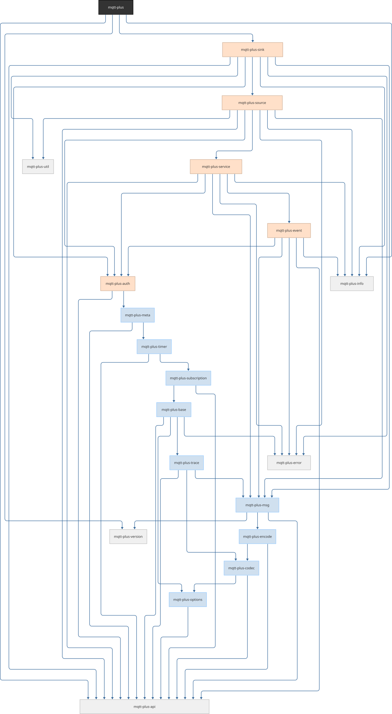

MQTT+ Architecture
==================

**MQTT+** is composed as a vertical chain of API and infrastructure trait
classes (mixins), each extending the previous. Additionally, some base
modules complement the functionality.

