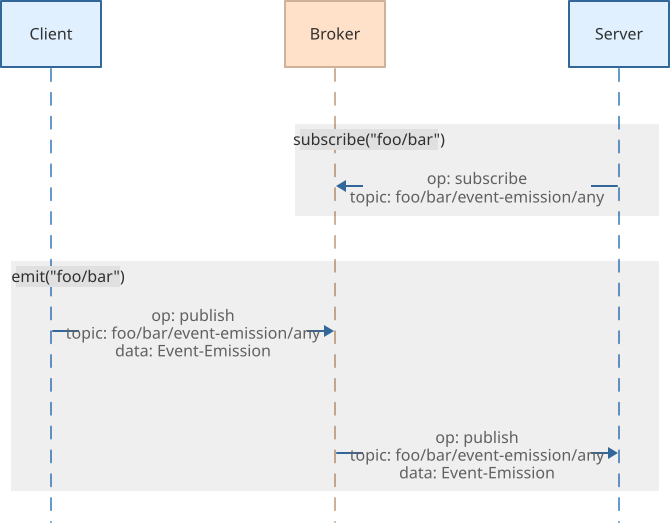
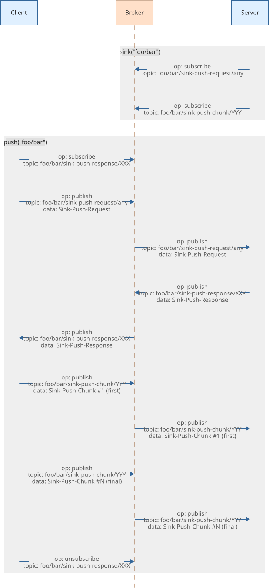
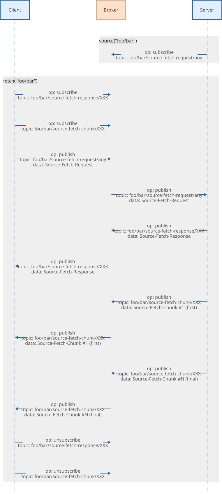

MQTT+ Communication Patterns
============================

Event Emission
--------------

Event Emission is a *uni-directional* communication pattern.
An Event is the combination of an event name and optionally zero or more parameters.
You *register* for events.
When an event is *emitted*, either a single particular receiver (in
case of a directed event emission) or *all* receivers are called and
receive the parameters as extra information.

> In contrast to the regular MQTT message publish/subscribe, this
> pattern allows to direct the event to particular receivers,
> provides optional information about the sender and receiver to
> receivers, supports authentication and meta-data, etc.

Service Call
------------

Service Call is a *bi-directional* communication pattern.
A Service is the combination of a service name and optionally zero or more parameters.
You *register* a service.
When a service is *called*, a single particular receiver (in case
of a directed service call) or *one* arbitrary receiver is called and
receives the arguments as the request. The receiver then has to
provide the service response.

> In contrast to the regular uni-directional MQTT message
> publish/subscribe communication, this allows a bi-directional [Remote
> Procedure Call](https://en.wikipedia.org/wiki/Remote_procedure_call)
> (RPC) style communication, supports authentication and meta-data, etc.

Sink Push
---------

Sink Push is a *bi-directional* communication pattern for pushing data.
A Sink is the combination of a sink name and optionally zero or more parameters.
You *register* a *sink* for receiving pushed data chunks.
When data is *pushed*, a single particular sink (in case of a directed
sink push) or *one* arbitrary sink is called and receives the data
chunks as a stream with arguments.

> In contrast to the regular MQTT message publish/subscribe, this
> pattern allows to transfer arbitrary amounts of arbitrary data by
> chunking the data via a stream. Additionally, it supports authentication
> and meta-data, and provides an `AbortSignal` to the sink handler for
> cooperative cancellation, etc.

Source Fetch
------------

Source Fetch is a *bi-directional* communication pattern for fetching data.
A Source is the combination of a source name and optionally zero or more parameters.
You *register* a *source* for sending data chunks.
When data is *fetched*, a single particular source (in case of a
directed source fetch) or *one* arbitrary source is called and sends the
data chunks as a stream with arguments.

> In contrast to the regular MQTT message publish/subscribe, this
> pattern allows to transfer arbitrary amounts of arbitrary data by
> chunking the data via a stream. Additionally, it supports
> authentication and meta-data, and provides an `AbortSignal` to the
> source handler for cooperative cancellation, etc.

